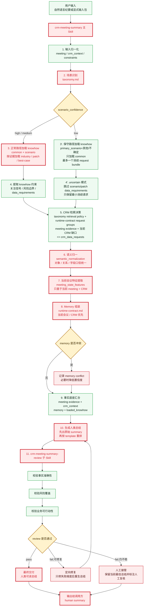

# summay-skill

## crm-meeting-summary 架构图

## 组件说明

### 1. 主 Skill
- 文件：`skills/crm-meeting-summary/SKILL.md`
- 职责：
  - 归一化输入
  - 识别场景
  - 约束最小 retrieval
  - 生成人类可读总结
  - 调用 review skill
  - 控制定向修复与人工复核

### 2. Review Skill
- 文件：`skills/crm-meeting-summary/review/SKILL.md`
- 职责：
  - 判断 pass / fail
  - 给出 `failure_reasons`
  - 给出 `targeted_regeneration_instructions`
  - 不重写正文，只做质量闸门
- 运行时判定口径以 `skills/crm-meeting-summary/review/SKILL.md` 为准；`docs/skills/crm-meeting-summary/review-rubric.md` 只作为人工阅读说明，不是 runtime 依赖

### 3. 参考契约层
- `skills/crm-meeting-summary/references/taxonomy.md`：定义场景分类与默认 retrieval policy
- `skills/crm-meeting-summary/references/runtime-contract.md`：运行时输入输出契约、request groups、memory 使用边界与审计规则的单一事实来源

### 4. 方法论与 Knowhow 层
- `docs/skills/crm-meeting-summary/meeting-methodology.md`：解释为什么这是 CRM 总结产品，而不是通用 transcript summarizer
- `skills/crm-meeting-summary/references/knowhow/common/`：第一层，所有 case 默认加载，提供跨场景共用的评估框架、基础判断边界与通用风险提醒，不是事实来源
- `skills/crm-meeting-summary/references/knowhow/by-scenario/`：第二层，在场景已识别时按 `scenario_slug` 加载，补充该场景专属的关注点、风险信号、成功标准与 `data_requirements`，参与 CRM 请求决策与总结生成，不是事实来源
- `skills/crm-meeting-summary/references/knowhow/by-industry/`：第三层，在行业有独立证据时加载，补充行业语境、行业常见约束与行业化判断边界，不是事实来源
- `skills/crm-meeting-summary/references/knowhow/patches/`：第四层，只在“场景 + 行业”组合有特殊规则时加载，用来修正前面三层在特定组合下不够准确的地方，相当于组合补丁，不是事实来源
- `skills/crm-meeting-summary/references/knowhow/best-cases/`：可选层，不承担分类、检索或 policy 约束职责，只在确有帮助时加载，用来补充高质量总结框架、表达结构和 coverage checklist，所以独立于前面按规则驱动的层，不是事实来源
- `skills/crm-meeting-summary/references/templates/`：模板层，只负责把已有 summary 按目录重排，不提供新事实

加载关系：
- 基础顺序是 `common -> by-scenario -> by-industry -> patches`
- `common` 提供底座，后续层只做细化，不替代底座
- `by-scenario` 决定场景化判断框架，是主分支
- `by-industry` 只补行业语境，不单独决定主场景
- `patches` 只修正特定“场景 × 行业”组合，不单独存在
- `best-cases` 不参与前面的规则链，它是独立的可选增强层，只补 summary 质量，不改变事实底座和检索边界
- `templates` 在总结生成之后才介入，只重排结构，不扩充内容

### 5. 开发辅助层
- `tests/crm_meeting_summary/helpers/real_runner.py`
- `tests/crm_meeting_summary/evals/run_real_evals.py`
- `tests/crm_meeting_summary/helpers/mock_runner.py`
- `tests/crm_meeting_summary/fixtures/mock-runtime/`
- `tests/crm_meeting_summary/evals/evals.json`

作用：
- 通过 `tests/crm_meeting_summary/helpers/real_runner.py` 调用真实 skill，并捕获完整最终返回值
- 通过 `run_real_evals.py` 批量跑关键 case
- 用 `tests/crm_meeting_summary/helpers/mock_runner.py` 做本地回归验证
- 用 mock data 演练输入
- 做文档与行为对齐验证

不是生产运行路径。

## 当前真实运行链路

真实调用时，`meeting record` 既可以直接内联到输入里，也可以通过 `meeting.record_text_path` 指向一个文本文件，也可以通过 `input_bundle_path` 指向一个目录输入包。目录输入包只允许读取 `meeting-record.txt`、`AccountObj.json`、`NewOpportunityObj.json`、`PersonnelObj.json`、`ContactObj.json`。主 skill 在归一化阶段先按 `record_text > record_text_path > input_bundle_path/meeting-record.txt` 的优先级得到最终会议纪要内容，再进入后续流程。

1. 调用 `crm-meeting-summary`
2. 主 skill 在 Claude runtime 内完成输入归一化与场景识别
3. 主 skill 加载 knowhow，并从 knowhow 中提取关注点、风险边界、`data_requirements`
4. 主 skill 按 `taxonomy.md` 的 retrieval policy + `runtime-contract.md` 的 request groups + 当前 meeting/CRM 缺口，形成最小 `crm_data_requests`
5. 主 skill 先产出 `semantic_normalization`，统一对象、关系、字段口径
6. 主 skill 再从当前 meeting + CRM 提取 `meeting_state_features`
7. 主 skill 组装 memory，并把 meeting evidence、crm_context、memory、loaded knowhow 汇合成 summary generation 的事实底座
8. 主 skill 先生成原始人类总结，再按 template 重排
9. 主 skill 调用 `crm-meeting-summary-review`
10. review pass 则交付最终人类总结
11. review 连续失败且两轮定向修复后仍无法稳定支撑，则保留当前最佳总结并要求人工复核

## 本轮补强点

本轮针对回归 case 收紧了这些约束：
- low confidence 必须落到 `其他 / 不确定` 或等价保守结论
- uncertain 模式不得加载 scenario knowhow / patches / best-cases
- uncertain 模式下只允许最小消歧请求
- memory 与当前会议冲突时必须在总结中暴露冲突边界
- 弱证据输入在两轮定向修复后必须进入人工复核
- 模板缺失项不得编造成确定性陈述

## 文档入口

- 输入方式：`docs/skills/crm-meeting-summary/example-input.md`
- 完整执行链路与标准输出样例：`docs/skills/crm-meeting-summary/case-execution-example.md`
- 运行时单一事实来源：`skills/crm-meeting-summary/references/runtime-contract.md`
- 运行时评审规则：`skills/crm-meeting-summary/review/SKILL.md`
- 评审说明文档：`docs/skills/crm-meeting-summary/review-rubric.md`
- 产品方法论：`docs/skills/crm-meeting-summary/meeting-methodology.md`
