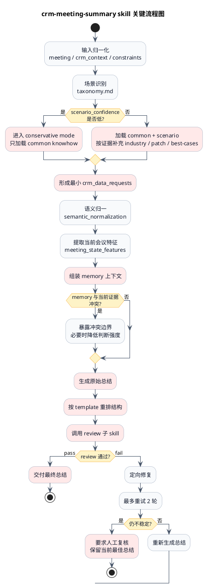
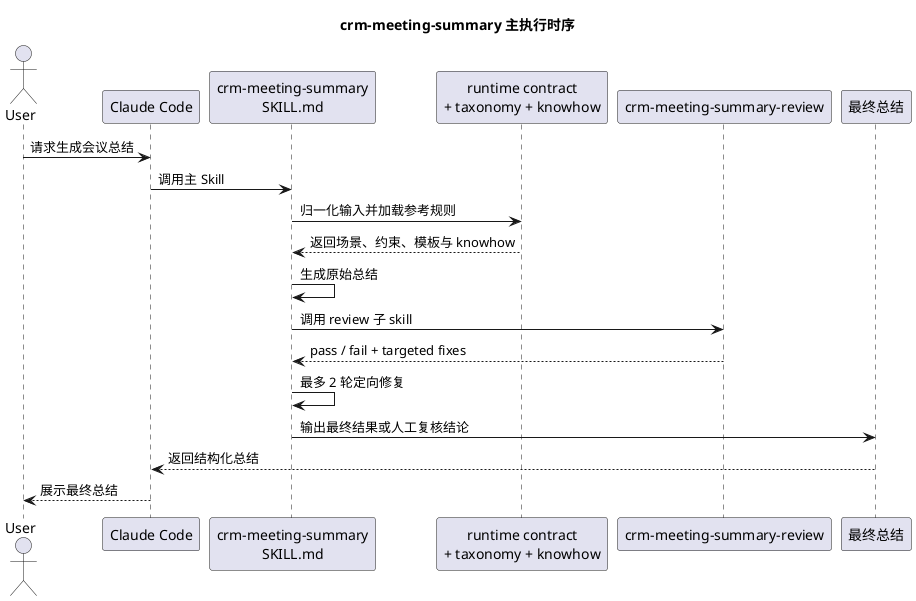
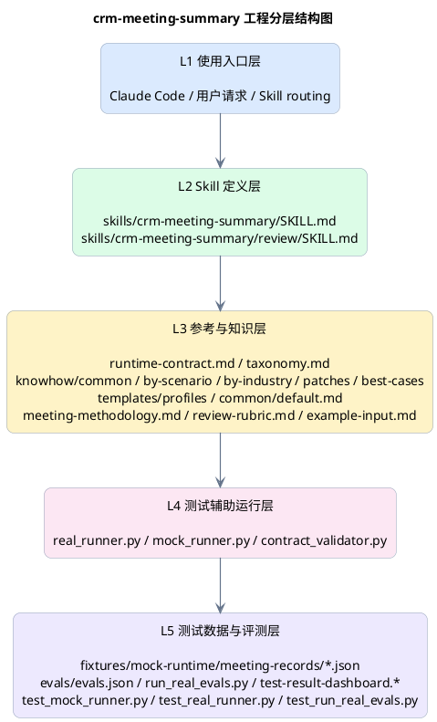
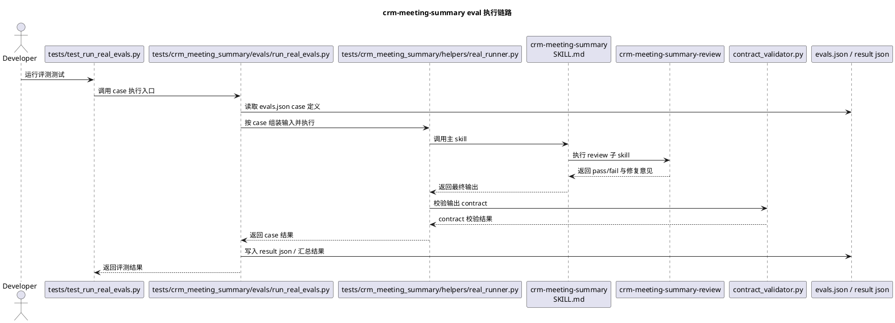

# crm-meeting-summary 

## 1. 总架构图

```plantuml
@startuml
title crm-meeting-summary 总架构图
skinparam shadowing false
skinparam packageStyle rectangle
skinparam defaultTextAlignment center
skinparam ArrowColor #94a3b8
skinparam ArrowThickness 0.8
skinparam package {
  BorderColor #cbd5e1
  FontStyle bold
  BackgroundColor #ffffff
}
skinparam rectangle {
  RoundCorner 14
  BorderColor #94a3b8
  FontColor #0f172a
}
top to bottom direction

package "互动 agent" {

  package "主 skill" {
    package "总结&待办" {
      rectangle "跟进" as SummaryFollowup #FDE68A
      rectangle "风险" as SummaryRisk #FDE68A
      rectangle "总结" as SummaryGenerate #FDE68A
    }
    package "发言人洞察" {
      rectangle "唤醒" as SpeakerWakeup #FDE68A
      rectangle "查询" as SpeakerQuery #FDE68A
      rectangle "识别" as SpeakerIdentify #FDE68A
    }
    package "问题&需求" {
      rectangle "查询" as NeedPrimaryAsk #FDE68A
      rectangle "转待办" as NeedExtract #FDE68A
      rectangle "生成" as NeedClassify #FDE68A
    }
  }

  package "公用 子skill" {
    rectangle "场景识别" as SharedScenario #DCFCE7
    rectangle "人名匹配" as SharedPerson #DCFCE7
    rectangle "..." as SharedMore #DCFCE7
  }

  package "Tool" {
    rectangle "memory 操作" as ToolMemory #FCE7F3
    rectangle "CRM 操作" as ToolCRM #FCE7F3
  }
}

package "Memory 底座" {
  package "memory" {
    rectangle "对象 memory" as ObjectMemory #EDE9FE
    rectangle "用户 memory" as UserMemory #EDE9FE
    rectangle "agent memory" as AgentMemory #EDE9FE
  }

  package "自更新" {
    rectangle "memory 类型
→ 短记忆(平台)
→ 长记忆(业务)" as OutputActions #FEF3C7
    rectangle "更新机制：定时触发/实时触发" as OutputRefresh #FEF3C7
  }

  package "数据源" {
    rectangle "特征体系" as OutputProducts #FEF3C7
    rectangle "用户行为埋点" as OutputFields #FEF3C7
  }
}

ToolCRM -[hidden]right- SharedScenario

SharedMore ..> SummaryGenerate
SharedPerson ..> SpeakerIdentify
SharedScenario ..> NeedClassify

SummaryGenerate --> ToolMemory
SummaryGenerate --> ToolCRM
SpeakerIdentify --> ToolCRM
NeedClassify --> ToolCRM

ToolCRM --> ObjectMemory
ToolMemory --> ObjectMemory
ToolMemory --> UserMemory
ToolMemory --> AgentMemory

ToolMemory ..> OutputActions
ObjectMemory ..> OutputActions
UserMemory ..> OutputActions
AgentMemory ..> OutputActions
ObjectMemory --> OutputFields
UserMemory --> OutputFields
AgentMemory --> OutputFields
OutputFields --> OutputProducts

@enduml
```

## 2. skill 关键流程图



## 3. 时序图



## 4. 工程分层结构图



## 5. README 中的旧 skill 架构图已并入第 2 张关键流程图

本节不再单独画新流程，README.md 里的旧 Mermaid skill 架构图已经合并到第 2 张图里。第 2 张图以原“处理流程图”为主干，同时保留了 README 旧图中的关键红框节点，用来标出真正决定质量和路径分叉的核心步骤。

关键红框节点保留为：
- conservative mode / 多层 knowhow 加载
- 最小 crm_data_requests
- memory 上下文组装
- 原始总结生成
- template 重排
- review 子 skill
- 最终交付 / 人工复核

## 6. eval 执行链路图


