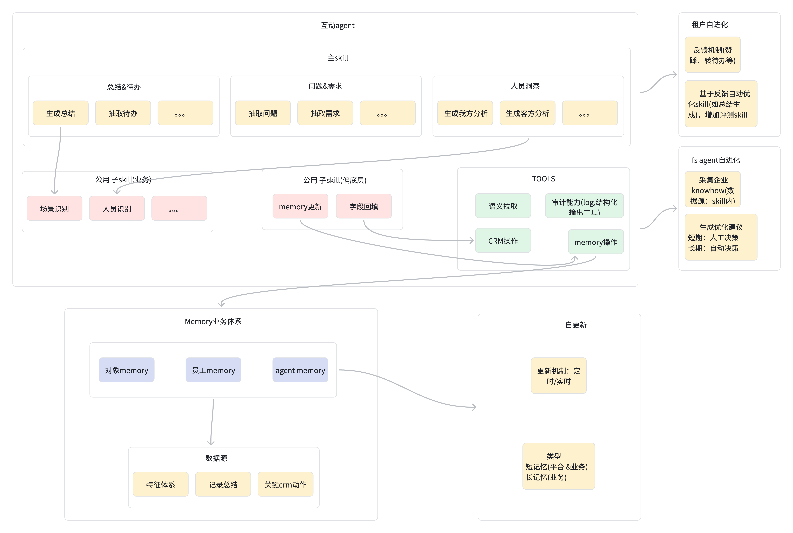
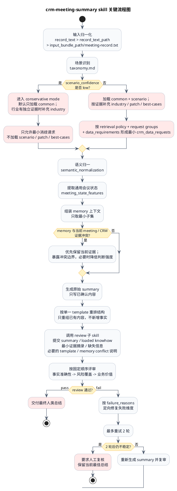
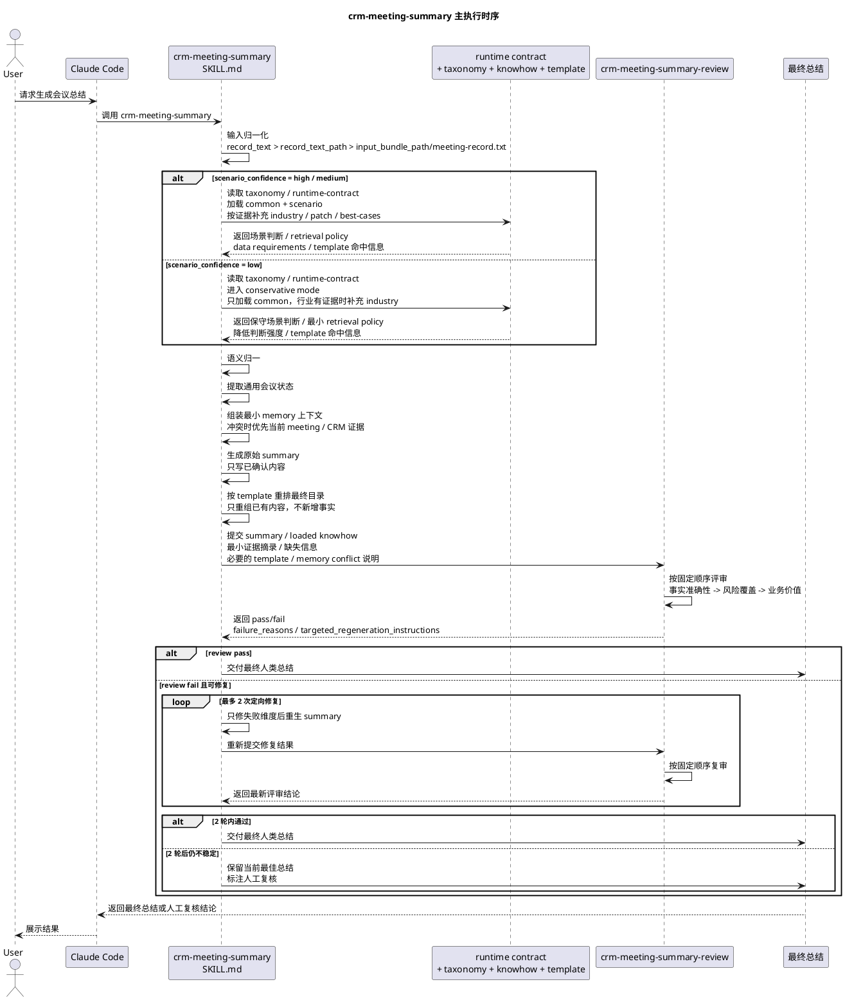

# crm-meeting-summary

## 1. 总架构图

## 2. skill 关键流程图

## 3. 时序图

## 4. 说明

- 本页只做结构示意，不作为运行时契约来源
- 正式口径以 `skills/crm-meeting-summary/references/runtime-contract.md`、`skills/crm-meeting-summary/SKILL.md`、`skills/crm-meeting-summary/review/SKILL.md` 为准
- 图中使用的 `semantic_normalization`、`meeting_state_features`、review loop 等词，仅表示内部流程阶段，不代表最终用户可见输出结构
